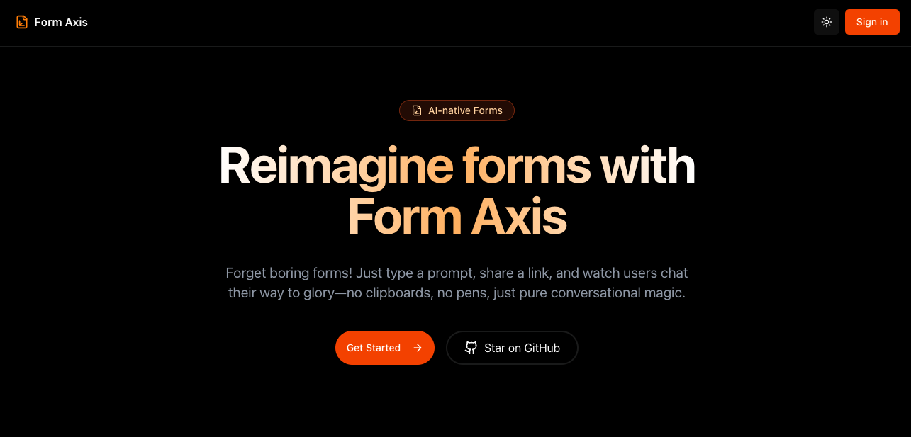

# 🚀 Forms & AI - Intelligent Form Builder

<div align="center">
  
  
  <p align="center">
    <strong>Transform your ideas into intelligent forms with AI-powered generation</strong>
  </p>
  
  <p align="center">
    <a href="#features">Features</a> •
    <a href="#demo">Demo</a> •
    <a href="#quick-start">Quick Start</a> •
    <a href="#tech-stack">Tech Stack</a> •
    <a href="#api-reference">API</a> •
    <a href="#contributing">Contributing</a>
  </p>
</div>

---

## 🎯 Overview

Forms & AI is a modern, full-stack form builder that leverages artificial intelligence to generate dynamic, intelligent forms from simple text prompts. Built with Next.js 15, TypeScript, and Prisma, it provides a seamless experience for creating, sharing, and analyzing form responses.

## ✨ Features

### 🤖 AI-Powered Form Generation

- **Natural Language Processing**: Simply describe your form in plain English
- **Smart Question Generation**: AI automatically creates relevant questions based on your prompt
- **Multiple Question Types**: Supports text, email, phone, number, date, and more
- **Intelligent Field Validation**: Automatic validation rules based on field types

### 📝 Form Builder & Editor

- **Visual Form Editor**: Drag-and-drop interface for customizing forms
- **Real-time Preview**: See changes instantly as you edit
- **Field Customization**: Add, edit, or remove questions with ease
- **Form Settings**: Configure form behavior, styling, and metadata

### 🎨 Beautiful UI/UX

- **Chat-style Form Interface**: Engaging conversational form experience
- **Dark/Light Mode**: Automatic theme switching based on system preferences
- **Responsive Design**: Works seamlessly on desktop, tablet, and mobile
- **Smooth Animations**: Polished interactions with Framer Motion

### 📊 Response Management

- **Real-time Analytics**: Track form completion rates and response times
- **Response Dashboard**: View and manage all form submissions
- **Export to Excel**: Download responses as XLSX files
- **Detailed Response View**: Analyze individual submissions

### 🔗 Sharing & Publishing

- **One-click Publishing**: Make forms live instantly
- **Shareable Links**: Generate unique URLs for each form
- **Form Archiving**: Organize forms with archive functionality
- **Public/Private Forms**: Control form visibility

### 🔐 Authentication & Security

- **Secure Authentication**: Powered by Clerk
- **User Management**: Personal dashboard for each user
- **Data Privacy**: SQLite local database - your data stays with you

## 🎬 Demo

### Test Credentials

```
Email: test@gmail.com
Password: test@123
```

### Live Demo Flow

1. **Sign In**: Use the test credentials above
2. **Create a Form**: Click "New Form" and enter a prompt like "Create an internship application form for CS graduates"
3. **Customize**: Edit questions, reorder fields, or add new ones
4. **Publish**: Click "Publish Form" to make it live
5. **Share**: Copy the shareable link and test the form
6. **Analyze**: View responses in the dashboard

## 🚀 Quick Start

### Prerequisites

- Node.js 18+
- npm/yarn/pnpm
- Git

### Installation

1. **Clone the repository**

```bash
git clone https://github.com/yourusername/forms-and-ai.git
cd forms-and-ai
```

2. **Install dependencies**

```bash
npm install
# or
yarn install
# or
pnpm install
```

3. **Set up environment variables**

```bash
cp .env.example .env.local
```

Edit `.env.local` with your credentials:

```env
# Clerk Authentication
NEXT_PUBLIC_CLERK_PUBLISHABLE_KEY=your_clerk_publishable_key
CLERK_SECRET_KEY=your_clerk_secret_key
NEXT_PUBLIC_CLERK_SIGN_IN_URL=/sign-in
NEXT_PUBLIC_CLERK_SIGN_UP_URL=/sign-up
NEXT_PUBLIC_CLERK_AFTER_SIGN_IN_URL=/dashboard
NEXT_PUBLIC_CLERK_AFTER_SIGN_UP_URL=/dashboard

# Google AI (Gemini)
GOOGLE_GENERATIVE_AI_API_KEY=your_gemini_api_key

# Database (SQLite)
DATABASE_URL="file:./dev.db"
```

4. **Set up the database**

```bash
npx prisma generate
npx prisma migrate dev --name init
```

5. **Run the development server**

```bash
npm run dev
# or
yarn dev
# or
pnpm dev
```

Open [http://localhost:3000](http://localhost:3000) to see the app.

## 🛠️ Tech Stack

### Frontend

- **Framework**: [Next.js 15](https://nextjs.org/) (App Router)
- **Language**: [TypeScript](https://www.typescriptlang.org/)
- **Styling**: [Tailwind CSS](https://tailwindcss.com/)
- **UI Components**: [shadcn/ui](https://ui.shadcn.com/)
- **Animations**: [Framer Motion](https://www.framer.com/motion/)
- **Forms**: React Hook Form + Zod validation

### Backend

- **API Routes**: Next.js Route Handlers
- **Database**: SQLite (via Prisma)
- **ORM**: [Prisma](https://www.prisma.io/)
- **Authentication**: [Clerk](https://clerk.dev/)
- **AI Integration**: Google Gemini AI

### Development

- **Package Manager**: npm/yarn/pnpm
- **Linting**: ESLint
- **Formatting**: Prettier
- **Git Hooks**: Husky (optional)

## 📁 Project Structure

```
forms-and-ai/
├── src/
│   ├── app/                    # Next.js app router pages
│   │   ├── (pages)/           # Grouped routes
│   │   │   ├── dashboard/     # Protected dashboard pages
│   │   │   └── forms/         # Public form pages
│   │   ├── api/               # API routes
│   │   └── layout.tsx         # Root layout
│   ├── components/            # React components
│   │   ├── dashboard/         # Dashboard components
│   │   ├── forms/             # Form-related components
│   │   ├── marketing/         # Landing page components
│   │   └── ui/                # Reusable UI components
│   ├── lib/                   # Utility functions
│   │   ├── db-service.ts      # Database service layer
│   │   ├── types.ts           # TypeScript types
│   │   └── utils.ts           # Helper functions
│   └── hooks/                 # Custom React hooks
├── prisma/
│   ├── schema.prisma          # Database schema
│   └── dev.db                 # SQLite database
├── public/                    # Static assets
└── package.json
```

## 🔌 API Reference

### Forms API

#### Create Form

```typescript
POST / api / forms / generate;
Body: {
  prompt: string;
}
Response: {
  (title, description, questions);
}
```

#### Save Form

```typescript
POST / api / forms / save;
Body: {
  (title, description, questions);
}
Response: {
  (formId, slug);
}
```

#### Get Form

```typescript
GET /api/forms/[id]
Response: Form object with questions
```

#### List Forms

```typescript
GET /api/forms/list
Response: Array of user's forms
```

#### Submit Response

```typescript
POST / api / forms / [id] / submit;
Body: {
  answers: Array<{ questionId; value }>;
}
Response: {
  (responseId, message);
}
```

## 🎨 Customization

### Theming

Edit `src/app/globals.css` to customize the color scheme:

```css
@layer base {
  :root {
    --primary: 259.7 94.3% 60.8%;
    --secondary: 240 3.7% 15.9%;
    /* ... other colors */
  }
}
```

### AI Prompts

Customize AI behavior in `src/lib/prompts/form-gen-prompt.ts`

### Form Styles

Modify the chat interface in `src/components/forms/public/`

## 🐛 Troubleshooting

### Common Issues

1. **"No JWT template exists with name: convex"**
   - This error appears if you have Convex configuration but aren't using it
   - Safe to ignore or remove Convex files

2. **AI Generation Fails**
   - Check your Google AI API key is valid
   - Ensure you have API quota remaining

3. **Database Errors**
   - Run `npx prisma migrate reset` to reset the database
   - Check `DATABASE_URL` in `.env.local`

4. **Build Errors**
   - Clear `.next` folder: `rm -rf .next`
   - Delete `node_modules` and reinstall

## 🚢 Deployment

### Vercel (Recommended)

1. Push to GitHub
2. Import project in Vercel
3. Add environment variables
4. Deploy!

### Self-hosting

1. Build the project: `npm run build`
2. Start production server: `npm start`
3. Use PM2 or similar for process management

## 🤝 Contributing

We love contributions! Please see our [Contributing Guide](CONTRIBUTING.md) for details.

1. Fork the repository
2. Create your feature branch (`git checkout -b feature/AmazingFeature`)
3. Commit changes (`git commit -m 'Add AmazingFeature'`)
4. Push to branch (`git push origin feature/AmazingFeature`)
5. Open a Pull Request

## 📄 License

This project is licensed under the MIT License - see the [LICENSE](LICENSE) file for details.

## 🙏 Acknowledgments

- [shadcn/ui](https://ui.shadcn.com/) for the beautiful components
- [Clerk](https://clerk.dev/) for authentication
- [Google Gemini](https://ai.google.dev/) for AI capabilities
- [Vercel](https://vercel.com/) for hosting

---

<div align="center">
  <p>Built with ❤️ by <a href="https://github.com/yourusername">Your Name</a></p>
  <p>
    <a href="https://github.com/yourusername/forms-and-ai/issues">Report Bug</a> •
    <a href="https://github.com/yourusername/forms-and-ai/issues">Request Feature</a>
  </p>
</div>
